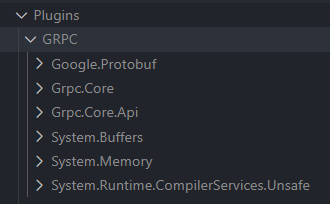
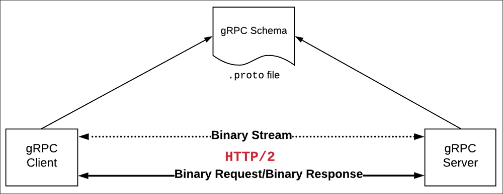

### Setup Development Environment

#### Add GRPC assemble reference (*.dll)
##### 1. Download grpc_unity_package

Current Version:  [Download](https://packages.grpc.io/archive/2022/03/851df6d46db90172427ad13178d0f319c6af889e-c6618abe-8aa9-4c92-a1ec-1c9ce2d58661/csharp/grpc_unity_package.2.45.0-dev202203040948.zip)

Download other versions from [link](https://packages.grpc.io/): 

##### 2. Decompress the package
Decompress the downloaded .zip package to the `Plugins/GRPC/` directory of the Unity project, as shown below:


#### Add Unity assemble reference (*.dll)
Current unity version: `2020.3.9f1`. 
Copy Both UnityEditor.dll and UnityEngine.dll into `Plugins/Unity/<unity version>/` (e.g., `Plugin/Unity/2020_3_9f1`)

### Build gRPC schema(*.proto)

What is a .proto file?

A .proto file is a description of a gRPC API written in the Protocol Buffers language specification. Protocol Buffers is a binary format. It is NOT a self-describing language. Thus, there needs to be a common "dictionary" used by both the gRPC client and server to encode and decode text and numbers into the Protocol Buffers binary format. This common dictionary is the .proto file. While the diagram below that illustrates this shows a single .proto file accessible to both client and server, it's possible for the client and server to have access to their own copies of this file. Such an implementation would involve the dynamic model discussed in the previous part of this series (See the figure below)



The following is an example of a simple .proto file named coolcar.proto This .proto file defines a single data structure, car along with a service, CoolCarService that publishes a procedure GetCar(). The procedure retrieves a car by vehicle identification number (VIN).

```proto
syntax = "proto3";

option csharp_namespace = "UnityEditorPortal";

package epochdot.greet;

// The greeting service definition.
service Greeter {
  // Sends a greeting
  rpc SayHello (HelloRequest) returns (HelloReply);
}

// The request message containing the user's name.
message HelloRequest {
  string name = 1;
}

// The response message containing the greetings.
message HelloReply {
  string message = 1;
}

```